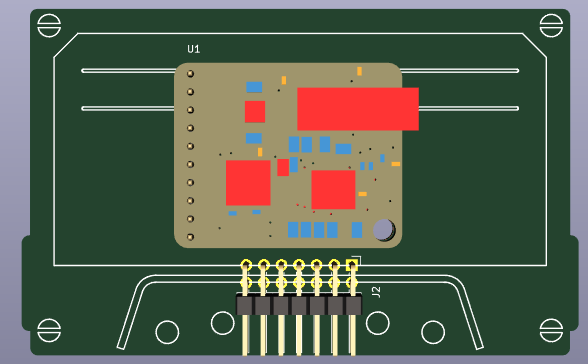
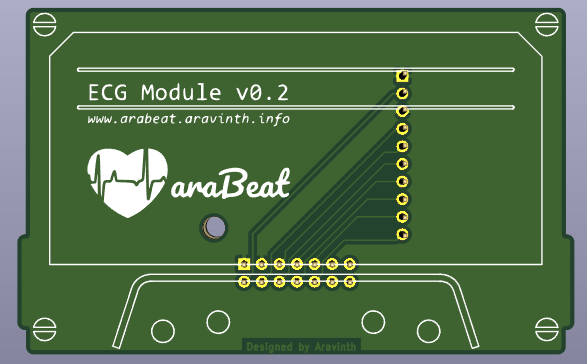
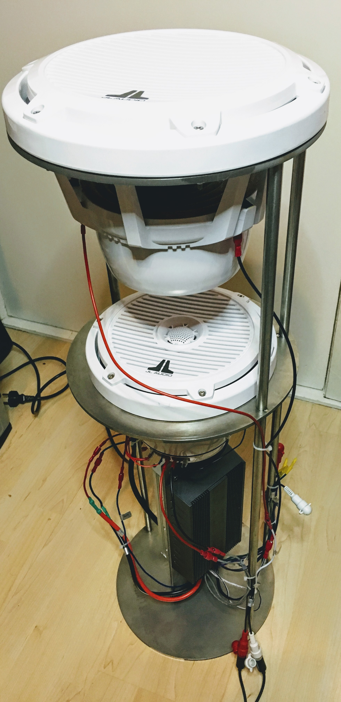

# araBeat

An interactive New Media Art system to translate the heartbeat of the visitor to an artistic form of sound and light in real-time.

This is a 12-feet-tall-permanent-public-installation, therefore it is built to withstand a harsh environment where the temperature goes to -20°C.

## ARTISTS

-   Aravinth Panch <http://aravinth.info> > New Media Art
-   Stacia Goodman <http://www.staciagoodmanmosaics.com> > Mosaic Art

## COLLABORATORS

-   Marc Basara - Project Management, Minneapolis
-   Stuart Ackerberg - Art Producer, Minneapolis
-   Felix Christmann - Industrial Design, Berlin
-   Alessandro Aresta - Sound Engineering, Berlin
-   Len Goodman - Graphic Design, Minneapolis
-   John Bean, Hart John, Randi Johnson - Production Management, Minneapolis
-   Pavel - Stainless Steel Structural Design & Construction, Minneapolis
-   Shresth Agrawal - Software Engineering, Berlin
-   Chris Kooper - Stainless Steel Metalworking, Berlin

## SUPPORTERS

-   Natalia Aravinth, Mladen Miljic, Darina Onoprienko - Family & Mental Support
-   David Riding, Jasmin Skenderi - Electrical Design Review, Next Big Thing
-   Christoph Iwasjuta - Advisor, MotionLab Berlin
-   Niranjan Harakel Rao - Firmware Optimisation, Next Big Thing
-   Karissa Xie, Rolin Pei - Stainless Steel CNC Machining, HLH Prototypes
-   Ivy Li, Monica Shen - PCB Manufacturing, Seeed Studio
-   Goran, S-Hamacher - Stainless Steel WaterJet Cutting, S-Hamacher Art Production
-   Robert Blowsky - Digital Signal Processing, Analog Devices

## STUDIOS AND MANUFACTURERS

-   nLab Berlin - Interaction Technology Design & Development
-   MotionLab Berlin - Prototype CNC Machining
-   Tivoli Too Minneapolis - Fiberglass and Steel Structure Construction
-   Seeed Studio Shenzhen - PCB Manufacturing
-   Troublemaker Shenzhen - Prototyping
-   HLH Prototypes Shenzhen - Stainless Steel CNC Machining
-   S-Hamacher Art Production Berlin - Stainless Steel WaterJet Cutting & Metalwork

## DESIGN

### Interaction Technology & Mosaic Installation Concept

## DEVELOPMENT

### Installation

-   #### Stage 1 Completion

-   #### Stage 2 Completion

-   #### Electronics & Audio Chambers

### Sensor Frontend

-   #### Design

-   #### Prototype

-   #### Sensor Frontend v1.0

### Interaction Technology

-   #### Wiring Design

-   #### Prototype v1.0

-   #### Prototype v2.0

-   #### Prototype v3.0

-   #### Prototype v4.0

-   #### Motherboard v0.1

-   #### ECG Module v0.1

-   #### ECG Module v0.2

-   #### MCU Module v0.1

-   #### Motherboard v1.0

-   #### Motherboard v1.0 in Weatherproof Industrial Heated Enclosure - NB121005-1HFS

### Audio

-   #### Marine Standard Tweeter, Sub-Woofer, Amplifier, PSU

