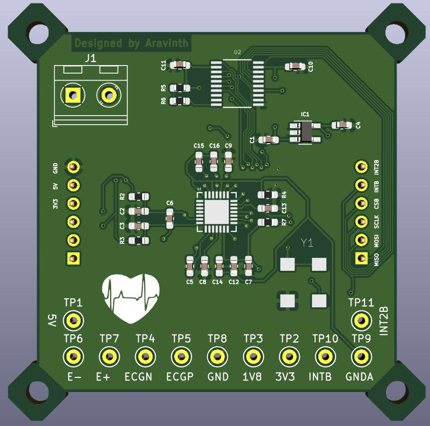

# araBeat
An interactive New Media Art system to translate the Heartbeat of the Visitor to an artistic form of sound and light in real-time.

## ARTISTS

- Aravinth Panch < http://aravinth.info >
- Stacia Goodman < http://staciagoodman.com >

## COLLABORATORS
- Marc Basara - Project Management
- David Riding - Hardware Engineering
- Felix Christmann - Industrial Design
- Alessandro Aresta - Sound Engineering
- Len Goodman - Graphic Design
- Hart John, Randi Johnson, John Bean - Fibre Glass & Structural Construction

## DESIGN

### Interaction Technology

### Installation

## DEVELOPMENT

### Installation

- #### Stage 1

### Interaction Technology

- #### Due Diligence

- #### System Prototype 1

- #### Baseboard Prototype

- #### Baseboard Prototype Testing with Stainless Steel Electrodes

- #### Sensor Frontend Design

- #### Sensor Frontend Prototype

- #### ECG Module Prototype

