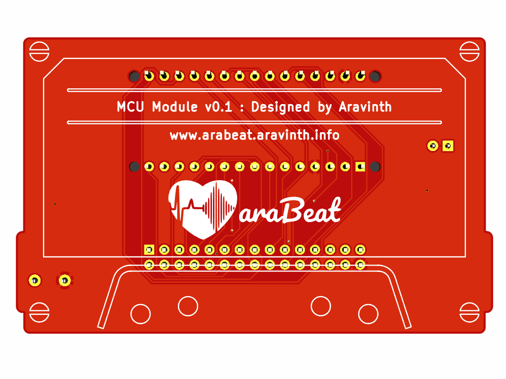
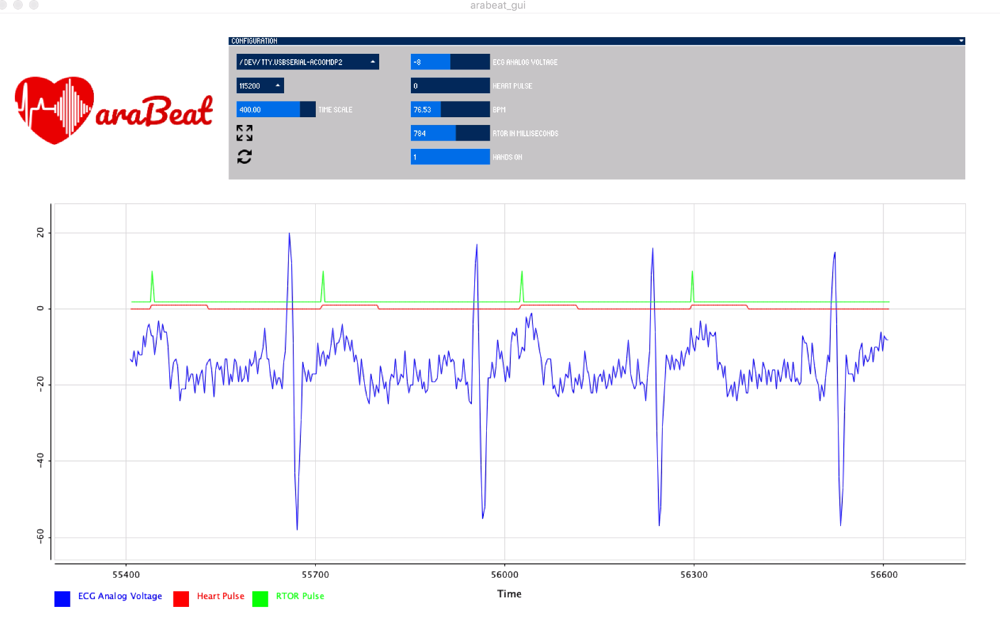

# araBeat

araBeat is an interactive new media art developed for the artistic sonification of Electrocardiogram (ECG). It is a complete system that consists of modules of ECG, DSP, MCU & Motherboard.

araBeat captures ECG of human Interactors through two gel-less electrodes, identifies the QRS complex of ECG, calculates the time difference between the R wave peaks and using Audio DSP, it synthesizes high & low frequency sound in realtime, which is synchronized with the heartbeats of the Interactor.

araBeat lies in the spectrum of new media art, the form of interaction with the technology is designed with aesthetics in mind using stainless steel electrodes in the form of human hand.

araBeat is designed to be extendable using modular designs, so that every component can be just individually plugged into the motherboard. It is also built as an industrial grade system to operate in harsh weather conditions from -40 ° Celsius to 85 ° Celsius. Furthermore, it is designed to comply with medical grade electronics to have low electrical noises and safety.

In the first public appearance, araBeat is integrated into a permanent & public mosaic art installation called "The Heart Of Uptown", located at MoZaic East, Minneapolis, USA.

<b>The Heart Of Uptown powered by araBeat</b>
 
 

## ARTISTS

-   Aravinth Panch &lt; <http://aravinth.info> > New Media Art
-   Stacia Goodman &lt; <http://www.staciagoodmanmosaics.com> > Mosaic Art

## COLLABORATORS

-   Marc Basara - Project Management, Minneapolis
-   Stuart Ackerberg - Art Producer, Minneapolis
-   Felix Christmann - Industrial Design, Berlin
-   Alessandro Aresta - Sound Engineering, Berlin
-   Len Goodman - Graphic Design, Minneapolis
-   John Bean, Giam Nguyen, Hart Johnson, Randi Johnson - Production Management, Minneapolis
-   Pavel Spieker, Kelly Ludeking, Anthony Kling - Structural Design & Construction, Minneapolis
-   Shresth Agrawal - Software Engineering, Berlin
-   Chris Kooper - Metalworking, Berlin

## SUPPORTERS

-   Natalia Aravinth, Mladen Miljic, Darina Onoprienko - Family & Mental Support
-   David Riding, Jasmin Skenderi - Electrical Design Review, Next Big Thing, Berlin
-   Karissa Xie, Rolin Pei - CNC Machining, HLH Prototypes, Shenzhen
-   Monica Shen, Ivy Li, Carmen Zheng - PCB Manufacturing, Seeed Studio, Shenzhen
-   Goran, Sascha Hamacher - WaterJet Cutting, S-Hamacher Art Production Studio, Berlin
-   Robert Blowsky - Digital Signal Processing, Analog Devices, EZ Forum

## STUDIOS AND MANUFACTURERS

-   nLab, Berlin - Interaction Technology Design & Development
-   MotionLab, Berlin - Prototype CNC Machining
-   Tivoli Too, Minneapolis - Structural Design & Construction
-   Seeed Studio, Shenzhen - PCB Manufacturing
-   Troublemaker, Shenzhen - Prototyping
-   HLH Prototypes, Shenzhen - CNC Machining
-   S-Hamacher Art Production Studio, Berlin - WaterJet Cutting & Metalworking

## DESIGN

### Interaction Technology & Mosaic Installation Concept

## DEVELOPMENT

### The Heart Of Uptown Installation

-   #### Stage 1 Completion

-   #### Stage 2 Completion

-   #### Stage 3 Completion

### Interaction Technology

-   #### Wiring Design

-   #### Prototype v1.0

-   #### Prototype v2.0

-   #### Prototype v3.0

-   #### Prototype v4.0

-   #### Motherboard v0.1

 

-   #### ECG Module v0.1

-   #### ECG Module v0.2

-   #### MCU Module v0.1

-   #### Motherboard v1.0

 

-   #### Motherboard v1.0 in Weatherproof Industrial Heated Enclosure

### Sensor Frontend

-   #### Design

-   #### Prototype

-   #### Sensor Frontend v1.0

#### Marine Standard Tweeter, Sub-Woofer, Amplifier, PSU

#### Electronics & Audio Chambers

## DESIGN & DEVELOPMENT TOOLS

-   #### KiCad v5.0.1-3 for PCB Design

-   #### Atom v1.34.0 + Platform IO v4.0.0a3 for ECG Firmware Development

-   #### Fusion 360 v2.0.5357 for Mechanical Design

-   #### Rhino + Grasshoper for Surface Design

-   #### Affinity Designer v1.6.1 for Vector Design

-   #### SigmaStudio v4.2 for Audio Synthesis

-   #### Processing v3.5.3 for araBeat GUI Software Development

-   #### araBeat GUI v0.9 for Optimisation of ECG and Audio Waveforms

## The Making - Behind the scenes

-   #### Aravinth - Prototype CNC Milling at MotionLab, Berlin

-   #### Stacia - Mosaic Making at Private Studio, Minneapolis

-   #### Stacia - Mosaic Making at Private Studio, Minneapolis

-   #### Len - Structural Construction at Tivoli Too, Minneapolis

-   #### Stacia - Styrofoam + Fibreglass Surface Finish at Tivoli Too, Minneapolis

-   #### Len - Mosaic Finish at Tivoli Too, Minneapolis

-   #### Alessandro - Sound Design at Private Studio, Berlin

-   #### Chris - Metalworking at S-Hamacher Art Production Studio, Berlin

-   #### Pavel - Metalworking at Tivoli Too, Minneapolis

-   #### Kelly - Metalworking at Tivoli Too, Minneapolis

