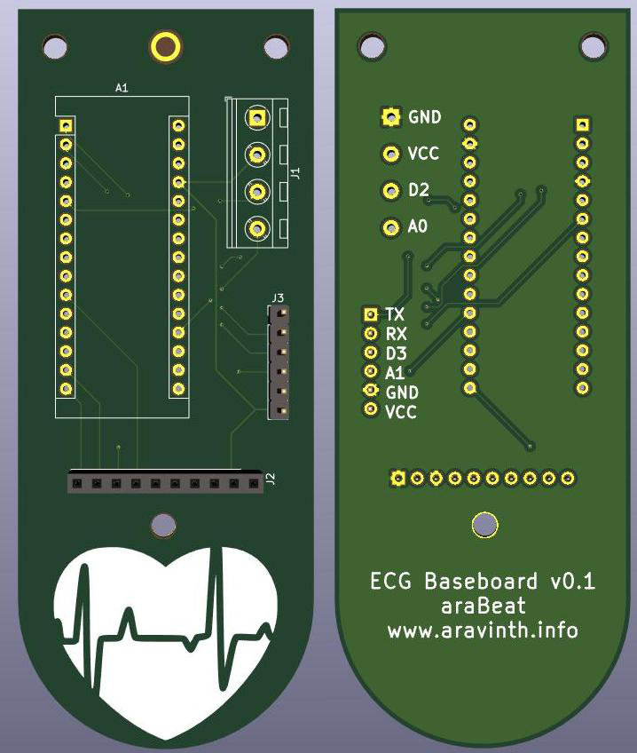
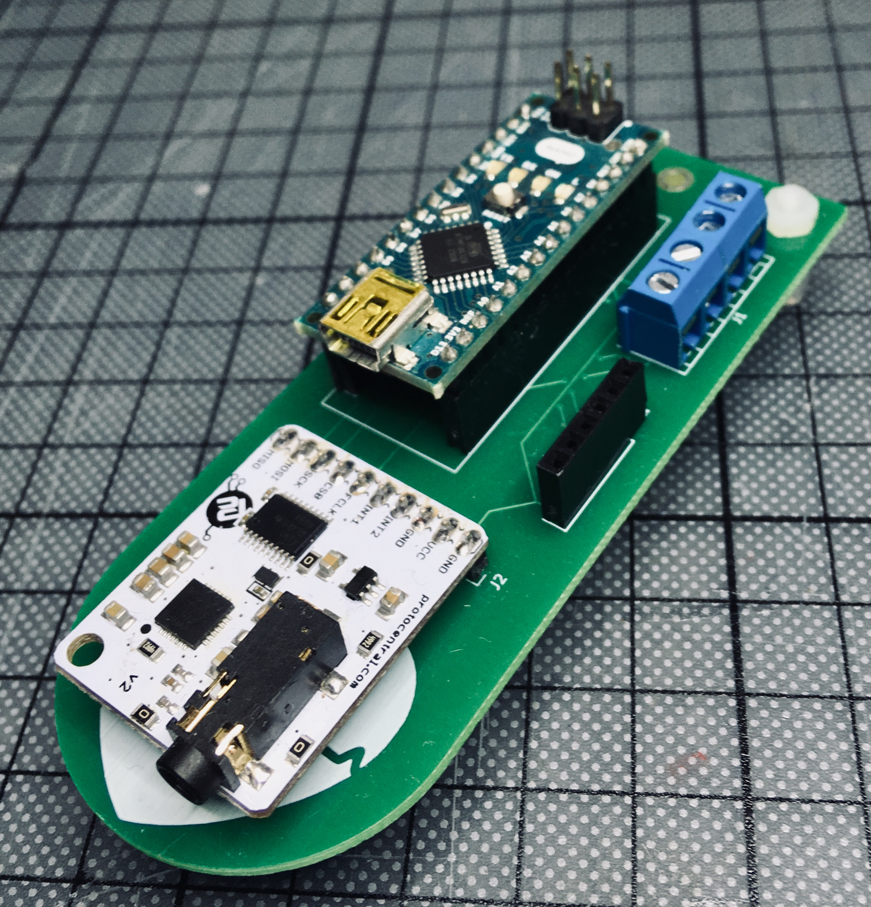
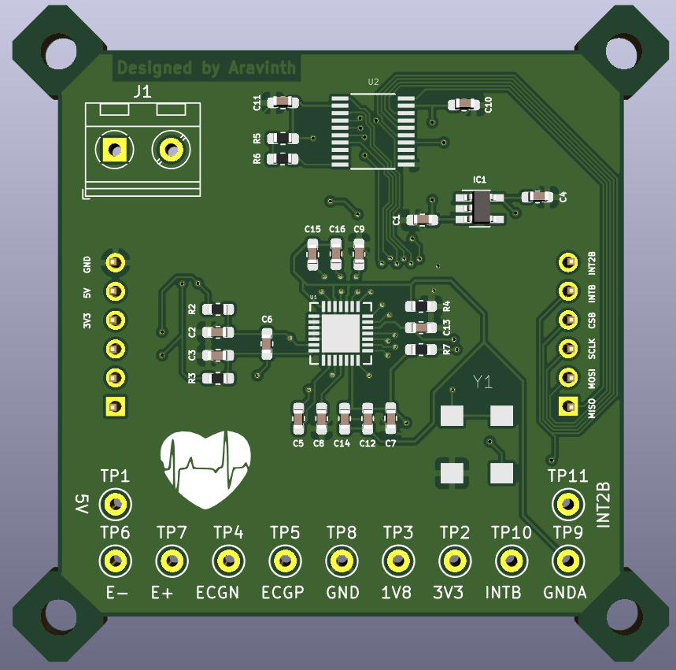
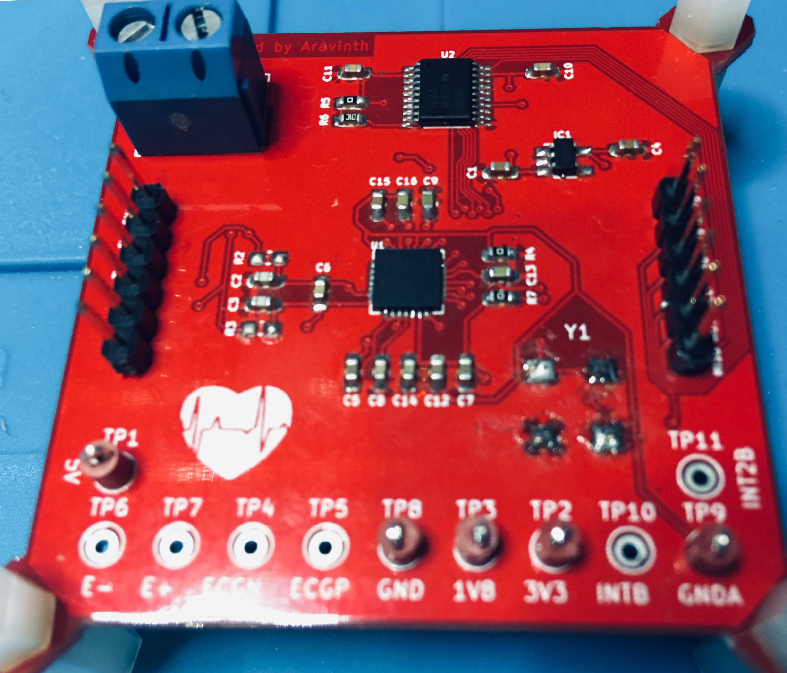

# ECG Firmware

This is developed to detect heartbeats reliably from 2 gel-less electrodes and send the pulses to DSP, that produces music from ECG.

### Firmware Development Setup
- Install Atom IDE (https://atom.io)
- Install PlatformIO IDE for Atom (https://platformio.org/platformio-ide) and restart Atom
- Open ./firmware/ecg/src/main.cpp
- Plugin araBeat ECG Development Kit via USB and click "Upload" under "PlatformIO" menu in Atom to flash the firmware

### araBeat ECG Development Kit

## MAX30003

MAX30003 is a complete, biopotential, analog front- end solution for wearable applications. It offers high performance for clinical and fitness applications, with ultra-low power for long battery life. The MAX30003 is a single biopotential channel providing ECG waveforms and heart rate detection.

The biopotential channel has ESD protection, EMI filtering, internal lead biasing, DC leads-off detection, ultra-low power leads-on detection during standby mode, and extensive calibration voltages for built-in self-test. Soft power-up sequencing ensures no large transients are injected into the electrodes. The biopotential channel also has high input impedance, low noise, high CMRR, programmable gain, various low-pass and high-pass filter options, and a high resolution analog-to-digital converter. The biopotential channel is DC coupled, can handle large electrode voltage offsets, and has a fast recovery mode to quickly recover from overdrive conditions, such as defibrillation and electrosurgery.

### Production Hardware

### Pinout

|MAX30003 pin     | Pin Function         |ATMEGA328 Pin     |
|-----------------|:--------------------:|-----------------:|
| MISO            | Slave Out            |  D12             |
| MOSI            | Slave In             |  D11             |
| SCLK            | Serial Clock         |  D13             |
| CS              | Chip Select          |  D7              |
| VCC             | Digital VDD          |  +5V             |
| GND             | Digital Gnd          |  Gnd             |
| FCLK            | 32K CLOCK            |  -               |
| INT1            | Interrupt1           |  -               |
| INT2            | Interrupt2           |  -               |
